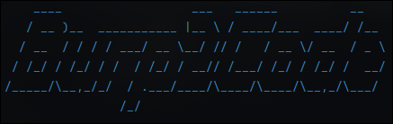
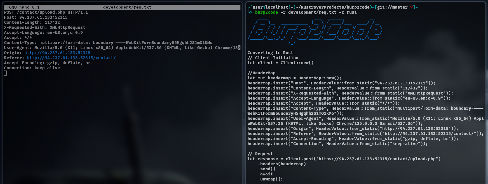

# Burp2Code

Convert an easily intercepted request into code.

# Features

Convert to 
- [x] Rust
- [ ] Python
- [ ] JavaScript
- [ ] Java
- [ ] C
- [ ] C++
- [ ] C#
- [ ] ...

Add
- [ ] Data

# Installation


# Demonstration



# Usage

HELP Menu
```shell
burp2code -h
```

Convert to programming language
```shell
burp2code -r <req.txt> -c <language>
```

# Contributing
